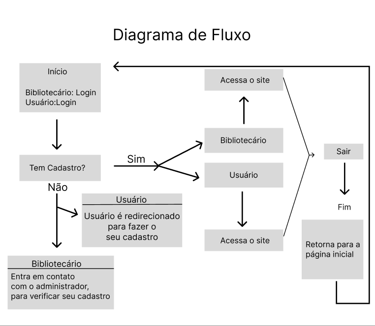

# Gerenciamento De Biblioteca

## Projeto Gerenciamento de Bibliotecas -  Avaliação Somativa Tarde

### Escopo:

O Gerenciamento de Biblioteca é uma aplicação web, que permitirá usuários se cadastrar no site, alugar e devolver livros, terá um bibliotecário que irá gerenciar tudo o que acontece na biblioteca, tendo um CRUD de (usuários, bibliotecário, devolução).

## Objetivos: 

__Específicos:__

- Aluguel de devolução de livros (Usuários);
- Gerenciamento da biblioteca (Bibliotecário);

__Mensuráveis:__
	
- Desempenho do site;
- Precisão nas buscas;
- Informações detalhadas sobre os livros;

__Atingíveis:__

- Interface dinâmica, e de fácil entendimento;
- Filtros dos livros;

__Relevantes:__

- Os usuários podem solicitar novos livros na biblioteca;
     	 
__Temporais:__

- O projeto irá ser realizado no prazo de 5 dias, começando em 19/08/2024;

## Riscos e Mitigações

### Problemas com as Devoluções dos Livros

**Possíveis Problemas:**
- Devoluções não registradas corretamente.
- Livros devolvidos não disponíveis para novos empréstimos.
- Confusões com livros danificados ou perdidos.

**Soluções:**
- Implementar registro detalhado e automatizado de devoluções.
- Sistema de notificações para devoluções pendentes e alertas sobre livros atrasados.
- Registro da condição do livro e fluxo para processar danos e perdas.

### Problemas com a Entrega Final da Aplicação

**Possíveis Problemas:**
- Atrasos devido a bugs ou funcionalidades incompletas.
- Problemas de compatibilidade com diferentes ambientes.

**Soluções:**
- Estabelecer cronograma detalhado e marcos intermediários, e realizar revisões regulares.
- Realizar testes unitários e de integração extensivos e usar ambientes de teste similares ao de produção.
- Preparar documentação completa e fornecer treinamento e suporte para a equipe de implementação.

### Imprevistos Durante o Desenvolvimento da Aplicação

**Possíveis Problemas:**
- Mudanças nos requisitos do projeto.
- Problemas técnicos inesperados.

**Soluções:**
- Estabelecer um processo formal para gerenciar mudanças e documentar todas as mudanças nos requisitos.
- Incluir margens de tempo no cronograma e alocar recursos adicionais para problemas inesperados.
- Manter comunicação constante e ajustar o planejamento conforme necessário.

### Armazenamento dos Dados (Falta de Espaço)

**Possíveis Problemas:**
- Falta de espaço no banco de dados.

**Soluções:**
- Monitorar o uso de espaço e configurar alertas para espaço baixo.
- Utilizar soluções de armazenamento em nuvem escaláveis e configurar backups regulares.
- Otimizar o banco de dados com indexação e particionamento.

### Problemas com Conexões

**Possíveis Problemas:**
- Problemas de conexão com o banco de dados.
- Interrupções na conectividade da rede.

**Soluções:**
- Implementar tratamento de erros e reconexão automática para falhas de conexão.
- Realizar backups regulares e utilizar servidores de banco de dados redundantes.
- Monitorar a conectividade da rede e realizar diagnósticos proativos para identificar problemas.

## Recursos:
	
Funcionalidades Básicas
Cadastro de Livros:

Adicionar novos livros com informações como título, autor, ISBN, editora, ano de publicação, e gênero.
Upload de capa do livro.
Edição de Livros:

Atualizar informações de livros existentes.
Alterar detalhes como título, autor, ou estado do livro.
Remoção de Livros:

Excluir livros do sistema.
Manter histórico de exclusões, se necessário.
Pesquisa e Filtros:

Busca de livros por título, autor, ISBN, ou gênero.
Aplicar filtros para pesquisa avançada.
Gerenciamento de Usuários:

Cadastro de novos usuários (membros da biblioteca).
Gestão de perfis de usuários com informações como nome, endereço, e e-mail.
Definição de permissões e papéis (por exemplo, admin, bibliotecário, membro).
Empréstimos e Devoluções:

Registro de empréstimos e devoluções de livros.
Histórico de empréstimos e devoluções.
Notificações de atraso de devolução.
Reservas de Livros:

Permitir que usuários reservem livros que estão atualmente emprestados.
Gerenciamento de reservas e notificações.
Relatórios e Estatísticas:

Relatórios sobre livros emprestados, disponíveis e reservados.
Estatísticas sobre o uso da biblioteca, como livros mais emprestados.
Funcionalidades Avançadas
Integração com Sistemas Externos:

Importação e exportação de dados para sistemas externos (por exemplo, em formatos CSV ou Excel).
Sistema de Notificações:

Alertas por e-mail ou SMS para lembretes de devolução e novas reservas.
Gestão de Multas:

Cálculo e gestão de multas por devolução tardia.
Controle de Acesso:

Diferenciação de acesso baseado em papel (admin, bibliotecário, usuário).
Controle sobre quem pode visualizar ou modificar determinados dados.
Interface de Administração:

Painel de controle para administração geral do sistema.
Ferramentas para gestão de configurações do sistema.
Considerações Técnicas
Segurança:

Autenticação e autorização de usuários.
Proteção contra acesso não autorizado e ataques cibernéticos.
Backup e Recuperação:

Estratégias para backup regular dos dados.
Planos de recuperação em caso de falhas ou perda de dados.
Responsividade e Design:

Design responsivo para compatibilidade com diferentes dispositivos e tamanhos de tela.
Interface amigável e intuitiva para todos os usuários.
Documentação e Suporte:

Guias e tutoriais para usuários e administradores.
Suporte técnico e FAQs.

## Diagrama de Classe
### Descrição das Classes

- **Livro**
  - Representa os livros disponíveis na biblioteca.
  - Atributos: `id`, `titulo`, `autor`, `isbn`, `editora`, `ano`, `genero`, `disponibilidade`.
  - Métodos: `cadastrar()`, `editar()`, `remover()`.

- **Empréstimo**
  - Representa um empréstimo de livro.
  - Atributos: `id`, `livroId`, `usuarioId`, `dataEmprestimo`, `dataDevolucao`, `devolvido`.
  - Métodos: `registrar()`, `devolver()`, `cancelar()`.

- **Usuário**
  - Representa um usuário da biblioteca.
  - Atributos: `id`, `nome`, `email`, `endereco`, `tipo`.
  - Métodos: `cadastrar()`, `atualizar()`, `remover()`.

- **Reserva**
  - Representa uma reserva de livro feita por um usuário.
  - Atributos: `id`, `livroId`, `usuarioId`, `dataReserva`, `status`.
  - Métodos: `criar()`, `cancelar()`, `listar()`.

- **Bibliotecário**
  - Representa um bibliotecário que gerencia a biblioteca.
  - Atributos: `id`, `nome`, `email`, `senha`.
  - Métodos: `cadastrarLivro(livro)`, `editarLivro(livro)`, `removerLivro(livro)`, `registrarEmprestimo(emprestimo)`, `devolverLivro(emprestimo)`.

## Diagrama de Fluxo

# Cronograma do Projeto

## Sprint 1 (Agosto - Setembro 2024)

- **Criar Diagrama de Classe**
  - Data de Conclusão: 30/08/2024
- **Implementar Cadastro de Livros**
  - Data de Conclusão: 15/09/2024
- **Desenvolver Funcionalidade de Empréstimo**
  - Data de Conclusão: 30/09/2024

## Sprint 2 (Outubro 2024)

- **Implementar Cadastro de Usuários**
  - Data de Conclusão: 15/10/2024
- **Adicionar Funcionalidade de Reservas**
  - Data de Conclusão: 31/10/2024

