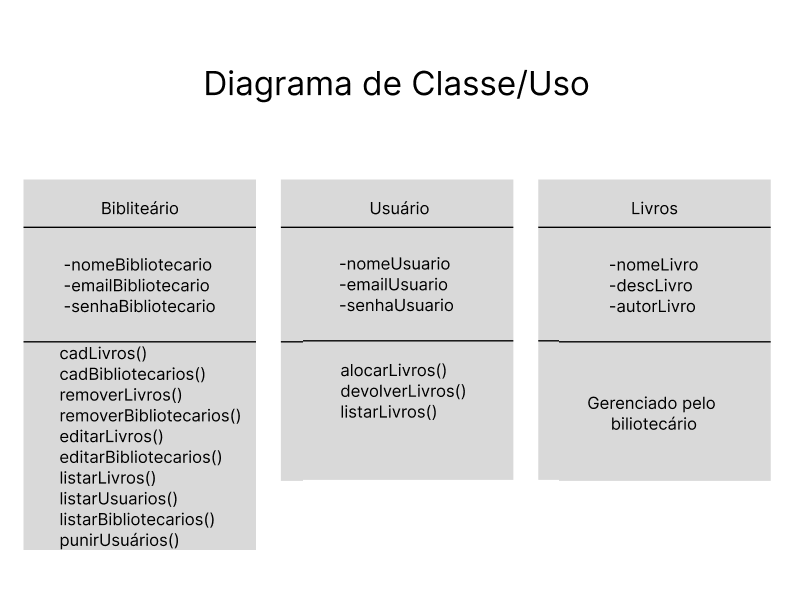

# Gerenciamento De Biblioteca

## Projeto Gerenciamento de Bibliotecas -  Avaliação Somativa Tarde

### Escopo:

O Gerenciamento de Biblioteca é uma aplicação web, que permitirá usuários se cadastrar no site, alugar e devolver livros, terá um bibliotecário que irá gerenciar tudo o que acontece na biblioteca, tendo um CRUD de (usuários, bibliotecário, devolução).

## Objetivos: 

__Específicos:__

- Aluguel de devolução de livros (Usuários);
- Gerenciamento da biblioteca (Bibliotecário);

__Mensuráveis:__
	
- Desempenho do site;
- Precisão nas buscas;
- Informações detalhadas sobre os livros;

__Atingíveis:__

- Interface dinâmica, e de fácil entendimento;
- Filtros dos livros;

__Relevantes:__

- Os usuários podem solicitar novos livros na biblioteca;
     	 
__Temporais:__

- O projeto irá ser realizado no prazo de 5 dias, começando em 19/08/2024;

__Possíveis risco:__

- Problemas com as devoluções dos livros;
- Problemas com a entrega final da aplicação;
- Imprevistos durante o desenvolvimento da aplicação;
- Armazenamento dos dados (falta de espaço);
- Problemas com conexões;

__Recursos:__
	
- Figma;
- BRmodelo;
- Word;
- Ambiente de desenvolvimento configurado (PHP, VScode, Bando de dados, API, Internet);
- Laravel Framework;
- PostgreSQL Database;

